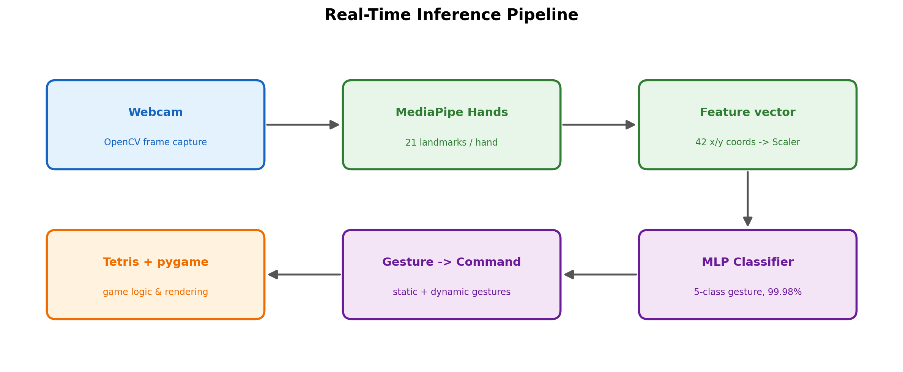
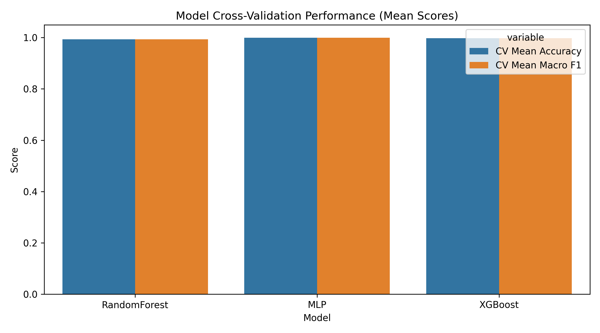
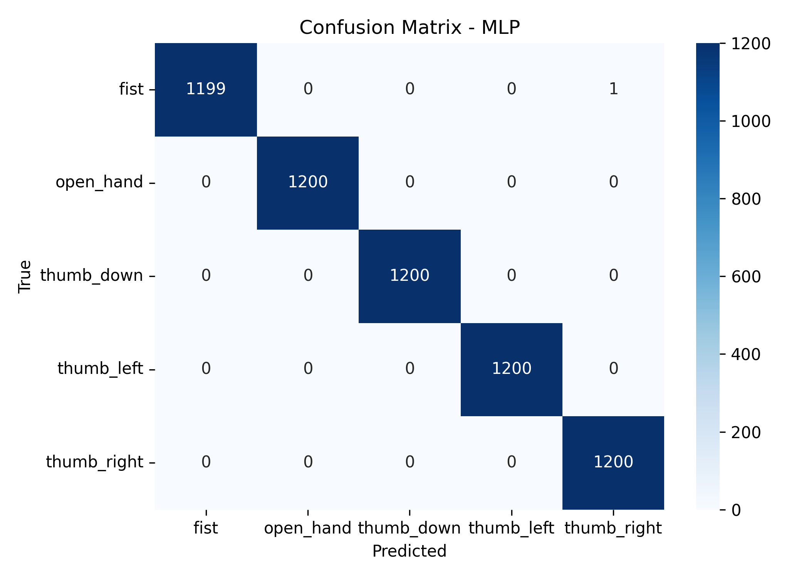
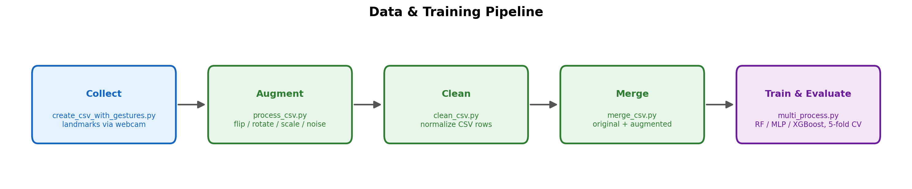

# Hand-Tracking Tetris 🖐️🎮

**Play Tetris with your bare hand.** A webcam captures your hand, [MediaPipe](https://developers.google.com/mediapipe)
extracts 21 skeletal landmarks per frame, a trained neural-network classifier turns them
into gestures in real time, and those gestures drive a full [pygame](https://www.pygame.org/)
implementation of Tetris — no keyboard, no controller.


> **Diploma thesis** — School of Electrical Engineering (Elektrotehnički fakultet),
> October 2025. Mentor: **Vladimir Jočović**.

---

## Overview

The application closes a full computer-vision → machine-learning → game-control loop at
interactive frame rates. Each webcam frame is converted into a 42-dimensional feature
vector (the x/y coordinates of 21 hand landmarks), normalized, and classified by a
Multi-Layer Perceptron. Static hand poses map directly to moves, while two **dynamic**
gestures (a rotation twist and a fast downward swipe) are detected from short landmark
histories, adding motion-based control on top of pose classification.



---

## Gesture Controls

Control is fully gesture-based. Five gestures drive the game, plus a neutral pose:

| Gesture | Hand pose / motion | Tetris action |
| --- | --- | --- |
| 👍 **Thumb left** | Thumb pointing left | Move piece **left** |
| 👍 **Thumb right** | Thumb pointing right | Move piece **right** |
| 👎 **Thumb down** | Thumb pointing down | **Soft drop** (accelerate fall) |
| 🔄 **Hand rotation** | Open hand twisted about the wrist | **Rotate** piece |
| ⬇️ **Fast hand swipe down** | Open hand moved sharply downward | **Hard drop** (instant lock) |
| ✊ **Fist** | Closed hand | Neutral / idle (no action) |

Keyboard shortcuts remain available for convenience: `P` pause, `R` restart, `Esc` / `q` quit.

---

## How It Works

1. **Capture** — OpenCV reads frames from the default webcam.
2. **Landmark extraction** — MediaPipe Hands detects one hand and returns 21 landmarks;
   their x/y coordinates are flattened into a **42-feature** vector.
3. **Preprocessing** — the vector is scaled with the same `StandardScaler` fitted during training.
4. **Classification** — an `MLPClassifier` predicts one of five gesture classes; a high
   confidence threshold (`> 0.99`) suppresses uncertain frames.
5. **Static → command** — `thumb_left`, `thumb_right`, and `thumb_down` map straight to
   move / soft-drop commands.
6. **Dynamic gestures** — while an **open hand** is held:
   - **Rotate** is triggered when the angle of the hand (measured across the index-base →
     pinky-tip vector) changes past a threshold, with a neutral-reset guard to prevent repeats.
   - **Hard drop** is triggered when the wrist's vertical velocity — computed over a rolling
     window of recent positions — exceeds a downward speed threshold.
7. **Game & render** — commands feed a self-contained Tetris engine (SRS-style wall kicks,
   lock delay, level-based gravity, scoring, top-5 high scores) rendered with pygame, while
   a debug OpenCV window shows the tracked hand and the recognized gesture.

---

## Machine Learning

Three classifiers were trained and compared on the collected landmark dataset using
**5-fold stratified cross-validation**. The MLP was selected for deployment.

| Model | Test accuracy | Test macro-F1 | CV accuracy (mean ± std) |
| --- | --- | --- | --- |
| **MLP** ✅ | **0.9998** | **0.9998** | **0.9996 ± 0.0002** |
| XGBoost | 0.9982 | 0.9982 | 0.9975 ± 0.0003 |
| RandomForest | 0.9923 | 0.9923 | 0.9932 ± 0.0007 |

<p align="center">
  
  
</p>

- **Dataset:** ~30,000 samples across 5 gesture classes (~6,000 each), balanced.
- **Features:** 42 per sample (21 landmarks × x/y), `StandardScaler`-normalized.
- **Augmentation:** horizontal flip (with left/right label swap), ±10° rotation,
  translation, scaling, and Gaussian noise — see `process_csv.py`.
- **Why MLP:** highest and most stable cross-validated accuracy, small model size, and
  fast per-frame inference suitable for real-time use.

The training script also emits per-model confusion matrices, feature-importance charts
(for the tree models), and a PCA projection of the test set — all under
`hand_tracking_tetris/evaluation_results_multi_cv_all/`.

---

## Data & Training Pipeline

The dataset is built and the models trained through a short, reproducible sequence of scripts:



| Step | Script | Purpose |
| --- | --- | --- |
| Collect | `create_csv_with_gestures.py` | Record labeled landmark samples from the webcam |
| Augment | `process_csv.py` | Geometric + noise augmentation of raw samples |
| Clean | `clean_csv.py` | Normalize augmented rows into a clean CSV |
| Merge | `merge_csv.py` | Combine original + augmented data |
| Train & evaluate | `multi_process.py` | Train RF / MLP / XGBoost, run CV, save models & figures |

---

## Project Structure

```
hand_tracking_tetris/
├── README.md                     # this file
├── requirements.txt
├── LICENSE
├── docs/
│   ├── generate_diagrams.py      # regenerates the README architecture/pipeline diagrams
│   └── assets/                   # figures used by this README
└── hand_tracking_tetris/
    ├── create_csv_with_gestures.py   # 1. data collection
    ├── process_csv.py                # 2. augmentation
    ├── clean_csv.py                  # 3. cleaning
    ├── merge_csv.py                  # 4. merge
    ├── multi_process.py              # 5. training + evaluation
    ├── gestures_control*.csv         # datasets (raw / augmented / merged)
    ├── evaluation_results_multi_cv_all/
    │   ├── model_comparison_cv.csv
    │   ├── feature_scaler.pkl / label_encoder.pkl
    │   ├── MLP/ RandomForest/ XGBoost/   # models, reports, confusion matrices
    │   └── *.png                     # comparison & PCA figures
    └── game/
        ├── tetris_control.py         # main app: vision + inference + Tetris
        ├── diagram.py                # Graphviz pipeline diagram (original)
        └── highscores.json
```

---

## Installation & Usage

**Requirements:** Python 3.10+, a working webcam.

```bash
# 1. Clone
git clone https://github.com/miksipiksic/hand_tracking_tetris.git
cd hand_tracking_tetris

# 2. Create a virtual environment
python -m venv .venv
# Windows
.venv\Scripts\activate
# macOS / Linux
source .venv/bin/activate

# 3. Install dependencies
pip install -r requirements.txt
```

### Play the game

The game loads model files with paths relative to its own folder, so run it from `game/`:

```bash
cd hand_tracking_tetris/game
python tetris_control.py
```

A camera window and the Tetris window will open. Position your hand in view and use the
gestures above. Press `Esc` (game window) or `q` (camera window) to quit.

### Retrain the models (optional)

```bash
cd hand_tracking_tetris
python multi_process.py
```

This regenerates all models, reports, and figures in `evaluation_results_multi_cv_all/`.

### Regenerate the documentation diagrams (optional)

```bash
python docs/generate_diagrams.py
```

---

## Tech Stack

- **Computer vision:** OpenCV, MediaPipe Hands
- **Machine learning:** scikit-learn (MLP, RandomForest), XGBoost, joblib
- **Game:** pygame
- **Data & viz:** NumPy, Pandas, Matplotlib, Seaborn

---

## Academic Context

This project was developed as a **diploma thesis** at the **School of Electrical Engineering
(Elektrotehnički fakultet)**, defended in **October 2025**, under the mentorship of
**Vladimir Jočović**. It demonstrates an end-to-end applied ML system: dataset construction,
model selection with cross-validation, and deployment inside a real-time interactive
application.

---

## Author & License

**Author:** Milena Vujčić

Released under the **MIT License** — see [`LICENSE`](LICENSE).
